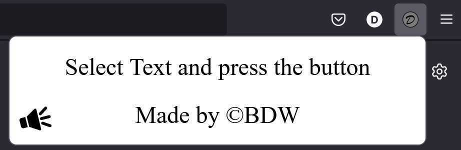
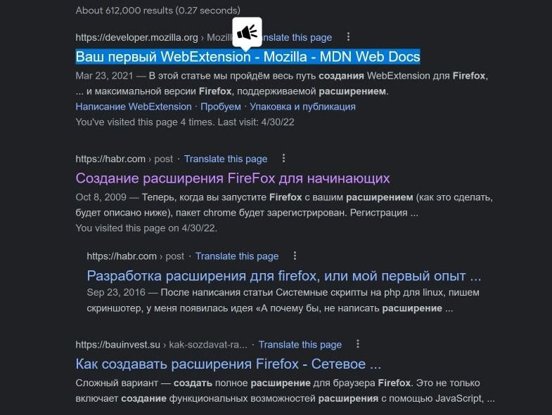
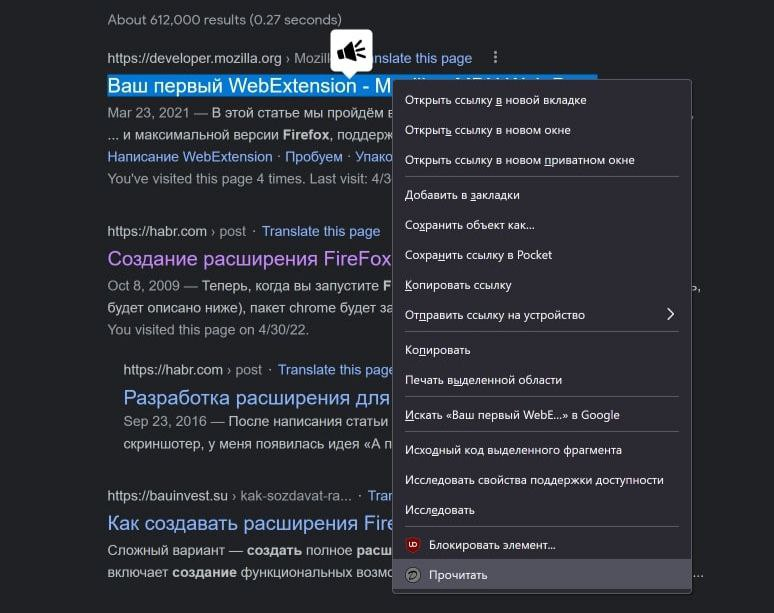

# BDwRA - Firefox Extension that reads aloud the selected text.

This is my first Firefox extension just for touching the ground of how on Earth do extensions work.

---

# What does that extension?

The Extension of mine can read aloud selected text on any website and even in inputs.

---

# What to do?

Just select some text and press popup button or action in context menu and you will hear fascinating voice of standart Web speaker.

---

## **Popup:**

## **Popup button: (appears when you select text)**

## **Context Menu ACtion:**

---

In that project I used: 
+ Vanulla JS
+ Firefox Web Extension API
+ DOM manipulations
+ Selection Web API
+ Speech Web API
+ Context Menu Modification

> I'm just learning
